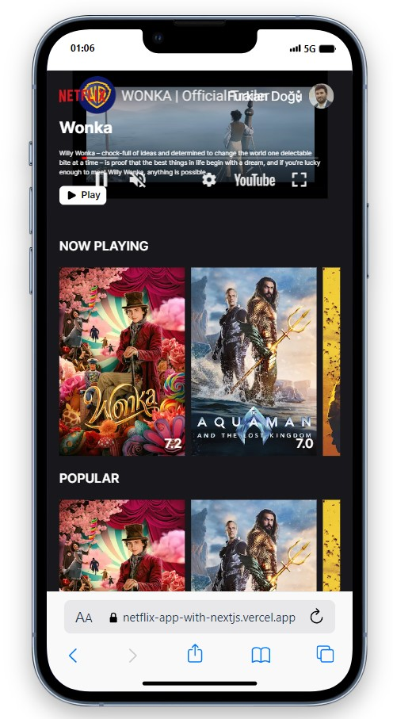
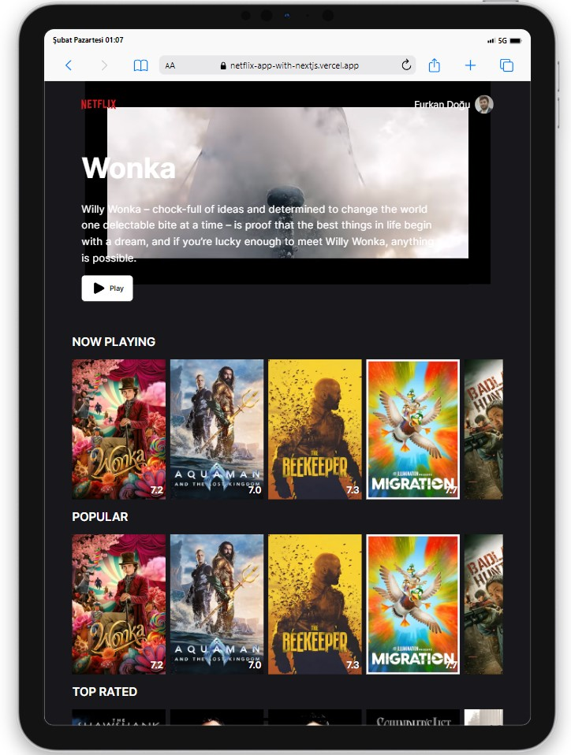
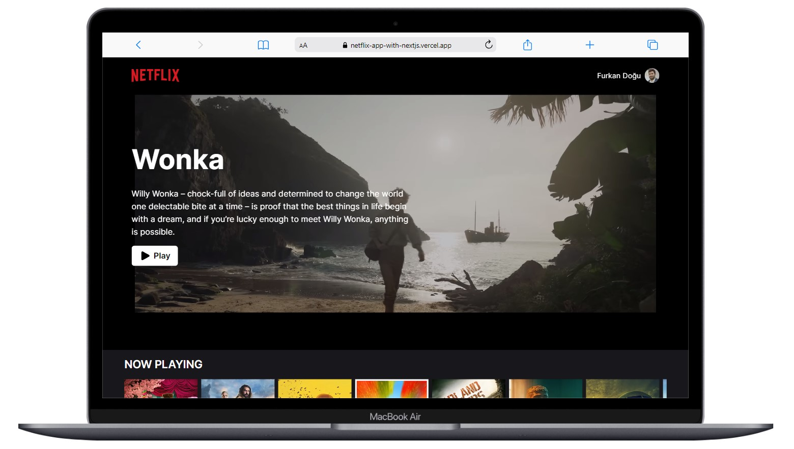

# Netflix App

  

## About the Project

This project is a Netflix clone created using Next.js. You can register or log in to the web application using your own email or Google account. Additionally, there is a "Forgot Password" button that allows you to reset your password by receiving an email to your registered email account. The project utilizes the TMDB API to fetch a list of popular, top-rated, and upcoming movies, presenting users with their posters, titles, and descriptions.

## Table of Contents

- [Features](#features)
- [Technologies Used](#technologies-used)
- [Usage](#usage)
- [Screenshots](#screenshots)

## Live Demo

[Netflix App](https://netflix-app-with-nextjs.vercel.app/)

## Features

- User registration via email or Google account.
- Password reset functionality.
- Pagination for smooth transitions between pages.
- A list of popular, top-rated and upcoming films

## Technologies Used

- React
- Next.js
- React-Router-Dom
- [TMDB API](https://www.themoviedb.org/) for movies data
- [Firebase](https://firebase.google.com/) for register and login processes
- Styling with [Tailwind](https://tailwindcss.com/) and CSS 
- [React-Toastify](https://fkhadra.github.io/react-toastify/introduction/) for alert 

## Usage

- Register or log in with your email or Google account.
- Discover information about popular, top-rated and upcoming films.
- Access detailed information and reviews for each item.

## Screenshots

  
  
  

## Compatibility

The project is compatible with both wide-screen computers and mobile devices.

## Acknowledgments

Movies data provided by [TMDB](https://www.themoviedb.org/)